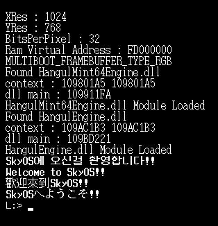

SkyOS32
----------------

SkyOS32 is a 32-bit operating system under development in C ++ in a Visual Studio environment.
In general, the development of an operating system is not easy,
because the development platform is so inconvenient.
SkyOS32 allows you to build a kernel with only one Visual Studio IDE in a Windows environment.
Develop an operating system just as you would develop an application through SkyOS32.

[네이버 카페 바로가기](https://cafe.naver.com/codemasterproject)

License
-------

SkyOS32 is BSD licensed.

Development Tool
-------------------

Visual Studio 2019  
QEMU  
WinImage  
[Google Drive](https://drive.google.com/drive/folders/1KR2yITxhtZJaK7uHf54bP1nslQGdMFAS?usp=sharing)

Feature
-------

Loading the kernel via GRUB  
Build the kernel with Visual Studio 2017  
C++ language support  
STL available  
try/catch implementation  
Debugging Engine  
Independent address space between processes  
Debugging using DLL  
Lua 5.42 and LuaTinker 
Multi Language Support  
A few GUI Sample  

Chapter
-------

01 HelloWorld  
02 CPU  
03 Exception Handler  
04 Memory Manager  
05 Heap  
06 C++  
07 Common Library  
08 Device  
09 Debugging  
10 Console System  
11 Application  
12 GUI  
13 ThirdParty  
14 DLL  
15 Advanced Debugging  
16 SkyOS64  

Sample Screen
-------

Multi Language Output  

